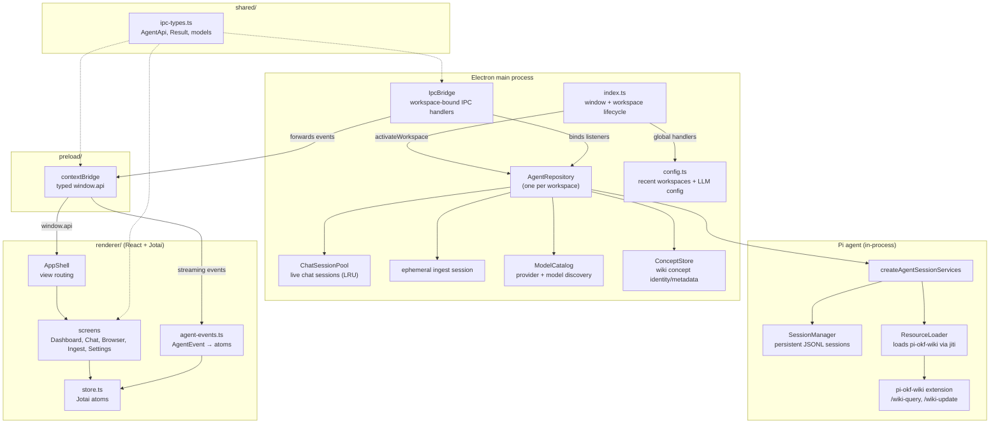

# Architecture

Open Wiki Studio is an Electron app whose main process hosts the
[`@earendil-works/pi-coding-agent`](https://github.com/earendil-works/pi-coding-agent)
Pi agent in-process, bundles the `pi-okf-wiki` extension, and exposes its
capabilities to a React renderer over a strictly-typed IPC contract. This
document describes how the layers wire together at a high level; per-decision
rationale lives in the ADRs (see [Where to go deeper](#where-to-go-deeper)).

---

## High-level wiring

The flow from a user action to an agent answer:

1. **Workspace selection** — the renderer calls `api.pickWorkspace()` /
   `api.openWorkspace()`; `index.ts` activates an `AgentRepository` for the
   chosen folder, which builds the Pi services (loading the bundled
   `pi-okf-wiki` extension via the `ResourceLoader`), creates a persistent
   `SessionManager`, and opens or creates a chat session.
2. **LLM config** — `configureLlm` is applied through the `ModelCatalog`
   (provider registration / API-key storage / model resolution) and onto the
   chat session pool and the ingest session.
3. **Chat** — the composer calls `api.ask(question)`; the main process runs the
   current session's turn as `/wiki-query <question>`. Streaming events
   (`agent_start` / `text_delta` / `agent_end`) are forwarded over IPC, routed
   by `agent-events.ts` into Jotai atoms, and rendered live.
4. **Ingest** — `api.ingest()` runs `/wiki-update` in a dedicated **ephemeral
   in-memory session** so chat sessions stay clean. The main process snapshots
   the wiki before and after, diffs them, and emits an `IngestSummary`
   (created / updated / leftover counts).
5. **Browsing** — file listing, preview, and the wiki graph are served from the
   filesystem by `files.ts` and `wiki-graph.ts`, both projecting onto the
   `ConceptStore`.

## Module responsibilities

### Main process

`src/main/` is the only layer that touches the Pi agent, the filesystem, and
the OS. Key modules:

- **`index.ts`** — window lifecycle and the global, workspace-independent IPC
  handlers (recent workspaces, app self-info, the folder picker). Activates an
  `AgentRepository` when a workspace is chosen and wires its `IpcBridge`.
- **`agent.ts`** — `AgentRepository`, the host for one workspace's embedded Pi
  agent. Owns the chat session pool, the ingest orchestration, the LLM
  configuration, and the GitHub Copilot OAuth flow. Forwards agent events to the
  renderer, tagged with the originating session path so the renderer can route
  them.
- **`ipc.ts`** — `IpcBridge` registers the workspace-bound IPC handlers and
  forwards the repository's event listeners to the renderer's web contents.
- **`wiki-scan.ts`** — snapshots the wiki (conceptId → body hash) and diffs
  before/after snapshots for the ingest summary.
- **`wiki-graph.ts`** — builds the wiki graph (nodes = concepts, edges =
  cross-references); keeps link extraction as its own graph policy.
- **`files.ts`** — filesystem operations on the `input/` / `wiki/` /
  `archive/` folders (listing, preview, add-to-input, reveal in file
  manager), delegating wiki concept reading to the `ConceptStore`. The
  `archive` folder is VIRTUAL: it physically lives at `wiki/archive/`
  (since pi-okf-wiki 0.2.0). `workspaceDir` centralizes the translation
  (used by `listFolder`/`revealInFileManager`), and `getPreview` resolves
  archive selections against the same archive base dir, so the
  `"input" | "wiki" | "archive"` `Folder` type stays unchanged AND archive
  previews are confined to `wiki/archive/` (no `../` traversal out of the
  archive, even to other workspace files).
- **`config.ts`** — persists recent workspaces and the LLM config in Electron's
  `userData/config.json`, with serialized reads/writes.
- **`resource.ts`** — resolves the bundled `pi-okf-wiki` extension entry path
  (dev: `node_modules`; packaged: `extraResources`).

### Preload

`src/preload/` exposes a strictly-typed `AgentApi` to the renderer via
`contextBridge`, mapping each method to an `ipcRenderer.invoke` call and
subscribing to the streaming event channels (chat, ingest, summary, Copilot
login). The renderer imports the typed `window.api` and never touches Electron
directly.

### Renderer

`src/renderer/` is the React UI (React 18 + Jotai, dark-only). It is a pure
consumer of the IPC contract:

- **`App.tsx`** — bootstrap (recent workspaces, app self-info) and binds the
  agent-event streams to the Jotai store.
- **`AppShell.tsx`** — the app frame: view routing, sidebar, the ingest bar,
  and the drag-and-drop-into-`input/` handler.
- **`store.ts`** — the Jotai atoms (screen, view, sessions, chat, ingest,
  browser, counts).
- **`screens/`** — `WorkspacePicker`, `FirstRun`, `Dashboard`, `Chat`,
  `Browser`, `IngestView`, `Settings`, `GraphView`.
- **`components/`** — `Sidebar`, `LlmConfigForm`, `FileTree`, `MarkdownView`,
  `Message`, `IngestBar`, `ContextMenu`, `Toast`, `AppShell`.

### Shared

`src/shared/` is the type and helper layer imported by all three others:

- **`ipc-types.ts`** — the IPC contract. The `AgentApi` interface is defined
  once here and implemented by the preload; the renderer imports the typed
  `window.api`. Also holds `Result<T>` and all shared models
  (`WorkspaceInfo`, `LlmConfig`, `SessionInfo`, `AgentEvent`, `IngestSummary`,
  `WikiGraph`, …).
- **`result.ts`** — `ok` / `err` / `errorMessage` helpers.
- **`i18n.ts`** — the shared `messages` dictionary (`en` / `de`) and the pure
  `t(locale, key, params?)` function.
- **`text.ts`** — small shared helpers (e.g. stripping the `/wiki-query`
  command prefix).

## Key deep modules

Four modules were extracted as deep modules — each owns one concern behind a
focused interface, giving that concern a real test surface:

- **ConceptStore** (`src/main/concept-store.ts`) owns concept identity,
  metadata, and body for a workspace's wiki. `wiki-scan`, `wiki-graph`, and
  `files` all project onto it instead of re-walking and re-deriving concept
  identity. See [ADR 0003](adr/0003-concept-store.md).
- **ModelCatalog** (`src/main/model-catalog.ts`) owns model discovery and
  provider registration, including the HTTP model-list fetching for Ollama and
  OpenAI-compatible endpoints and the auth-gated static catalog for
  Anthropic/OpenAI/Google. See [ADR 0004](adr/0004-model-catalog.md).
- **ChatSessionPool** (`src/main/chat-session-pool.ts`) owns chat session
  creation, LRU residency, and in-progress streaming-text tracking, so multiple
  chats can stream in parallel without the residency invariants leaking into
  the repository. See [ADR 0005](adr/0005-chat-session-pool.md).
- **AgentEvents** (`src/renderer/agent-events.ts`) owns the renderer-side
  adapter from the `AgentEvent` stream to Jotai atoms — routing chat events by
  session and driving the ingest state machine. See
  [ADR 0006](adr/0006-agent-events-binding.md).

## The IPC contract

The renderer never imports Electron or the Pi agent directly. The
`AgentApi` interface is defined **once** in `src/shared/ipc-types.ts`, implemented
by the preload's `contextBridge` (`src/preload/index.ts`), and consumed by the
renderer as the typed `window.api`. Adding or changing a capability means
changing the shared interface, the preload mapping, the main-process handler,
and the renderer call together — the contract is the single source of truth.

Every IPC handler returns a `Result<T>` — a discriminated union of
`{ success: true; data: T }` or `{ success: false; error: AppError }`. The main
process converts internal exceptions into a `Result` before returning, so
callers always check `result.success` rather than catching throws across the
process boundary. The same `Result` type is used by the in-process repositories
(`AgentRepository`, `ModelCatalog`, filesystem helpers), keeping error handling
uniform across the app.

## Isolation from the user's Pi setup

The app does **not** use the user's global `~/.pi/agent`. It runs from its own
isolated agent directory under Electron's `userData/agent`, and the
`ResourceLoader` is created with `noExtensions: true` so Pi loads **no**
project-local or global extensions — only the bundled `pi-okf-wiki`, supplied
via `additionalExtensionPaths`. This prevents command-name collisions (Pi would
rename duplicate commands like `wiki-query:1` / `wiki-query:2`, breaking the
calls) when a user has `pi-okf-wiki` installed elsewhere.

LLM configuration lives in the app's own `userData/config.json` and is applied
to the isolated `AuthStorage` on each workspace activation, so a user's separate
Pi configuration is never touched.

## Where to go deeper

Decision records for the deep-module extractions and other architectural
choices live in `docs/adr/`:

- [ADR 0003 — ConceptStore](adr/0003-concept-store.md)
- [ADR 0004 — ModelCatalog](adr/0004-model-catalog.md)
- [ADR 0005 — ChatSessionPool](adr/0005-chat-session-pool.md)
- [ADR 0006 — Agent-events binding](adr/0006-agent-events-binding.md)